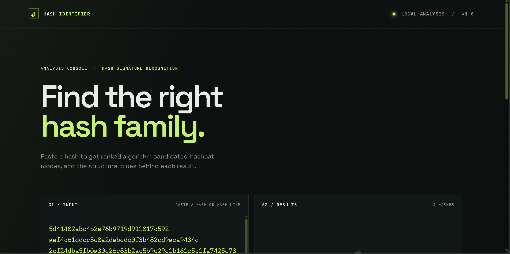
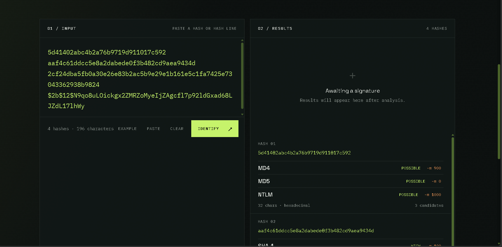

# Hash Identifier

A small defensive tool that estimates possible hashing algorithms from a hash string. It reports **possible algorithms**, not certainty: different algorithms can produce the same length and character representation.

## Run locally

```bash
npm install
npm start
```

Open <http://localhost:3000>. For development, use `npm run dev` to restart the server when files change.

## API

`POST /api/identify`

```json
{ "hash": "5d41402abc4b2a76b9719d911017c592" }
```

The response includes `inputLength`, detected `format`, an `ambiguous` flag, an explanatory `message`, and matching algorithms with their hashcat `mode`.

## Screenshots

### Batch input



### Analysis results



## Supported patterns

MD4, MD5, NTLM, SHA-1, SHA-224, SHA-256, SHA-384, SHA-512, bcrypt, Argon2, scrypt, md5crypt, sha512crypt, DEScrypt, WPA hc22000, and NetNTLMv2.

## Test

```bash
npm test
```

The project intentionally does not include password cracking or credential recovery functionality.
